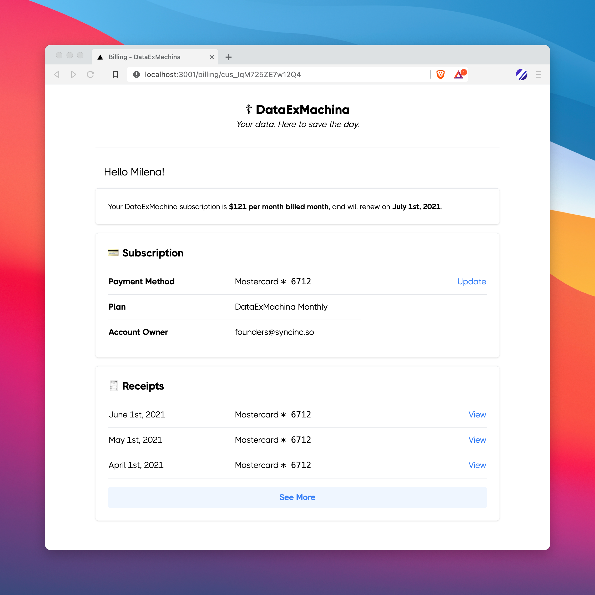
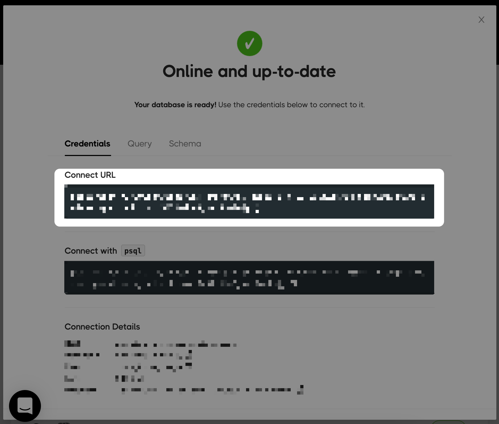
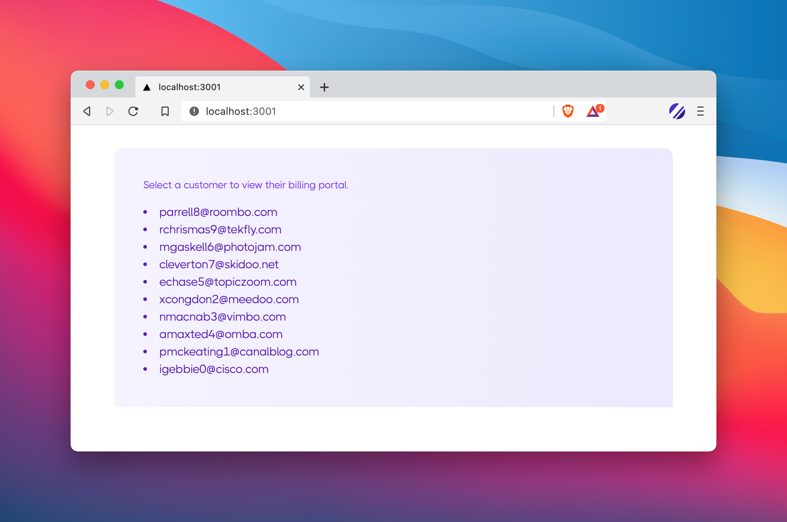

# Plug-and-play Stripe billing portal

This Stripe billing portal is a Next.js/Tailwind app. On the back-end, it is powered by a Postgres replica containing Stripe data (thanks to Sync Inc).



This repo uses plain `node-postgres` (`pg`) for all SQL queries. Example repos with popular Node ORMs coming soon.

### Setup

To use for yourself:

**1. Copy `.env.example` → `.env.local`**

Run the following:

```bash
cp .env.example .env.local
```

You'll see in `.env.local` that there are two env variables you need to set:

```bash
PGCONN=
STRIPE_KEY=
```

For `STRIPE_KEY`, grab a key [from your Stripe dashboard](https://dashboard.stripe.com/apikeys).

For `PGCONN`, use the Postgres connection URL provided by Sync Inc in the following step.

**2. Setup your Sync Inc database**

With Sync Inc, you can provision a real-time Postgres replica in AWS with all your Stripe data.

[Sign-up for an account here](https://app.syncinc.so/signup) (free to start).

At the end of the on-boarding process, Sync Inc displays your PG connection URL. Copy and paste this URL as your `PGCONN`:



That's it! Now, on `/`, you'll see a list of customers. Click on one to see their billing portal:



### How it works

**Data**

The React front-end uses Next's `/api` features to query a Postgres database containing Stripe data. There are three API endpoints:

- `GET /customers`: For populating the list of customers on `/`
- `GET /customer/[id]`: Hydrates the billing portal with the customer details, subscription data, receipts, etc.
- `POST /customer/billingPortal`: If a customer wants to change their payment method, this generates a link to Stripe's billing portal to redirect them to

To get a sense of how it all works: in `./pages/api/customer/[id].ts`, you'll see an API handler function that first grabs the id from the path:

```js
let { id } = req.query;
```

Then composes a response object with a number of SQL queries:

```js
let customer = await getOne(`select * from customer where id = $1`, [id]);
let subscription = await getOne(
  `select * from subscription where customer_id = $1`,
  [id]
);
```

> Note: to optimize performance/round-trips to the database, these queries can be combined into one super query.

**Styles**

Styles are all done with [Tailwind](https://tailwindcss.com/).
